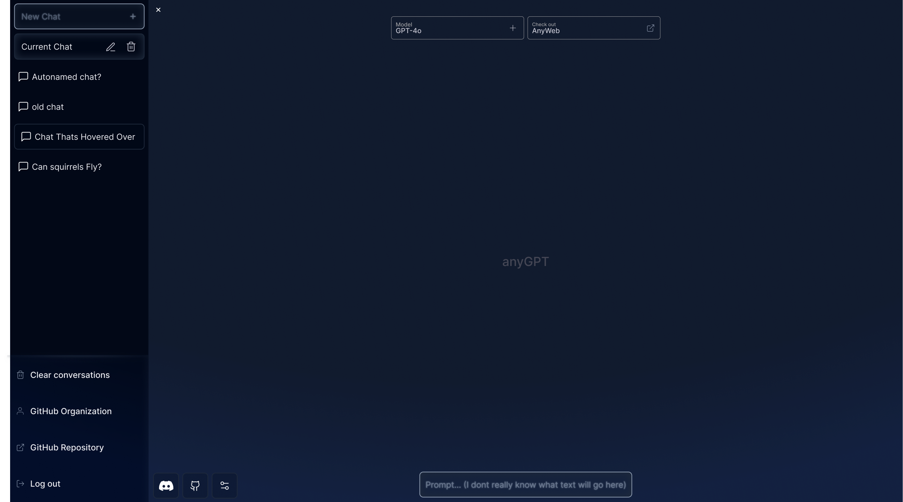

# anyGPT

Open-source AI API and app workspace for centralizing many model providers behind one endpoint.

## Quick Start

```bash
bun install
bun run setup
bun run dev
```

Use Bun for installs and workspace scripts. The API runtime and system services still target Node.js 20/22.

UI: LibreChat wrapper lives in `apps/ui` (see `apps/ui/README.md`).


